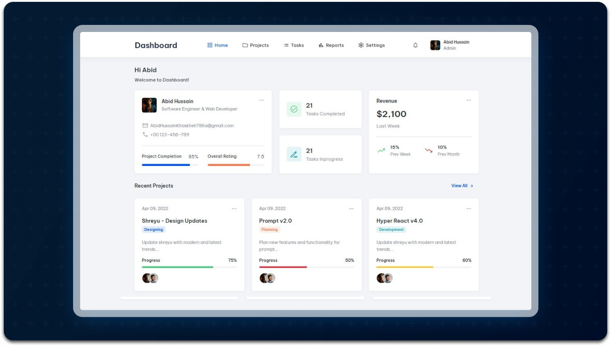

<div align="center">
  
  )
  
  
  [](https://www.linkedin.com/in/abidhussainsoftware/)

  <br />
  <br />
  
  

  <h2 align="center">Dashboard - Admin Dashboard</h2>

  <p>This is a <strong>responsive</strong> dashboard that adapts perfectly across all devices.</p>

  <a href="https://AbidHussainOFFICIAL.github.io/ControlPanel/"><strong>➥ Live Demo</strong></a>

</div>

---

## Demo Screenshots



---

## Prerequisites

Before you begin, make sure you have the following installed:

- [Git](https://git-scm.com/downloads "Download Git")

---

## Run Locally

To run **Dashboard** locally, open your terminal and run the following command:

### Linux and macOS:

```bash
sudo git clone https://github.com/AbidHussainOFFICIAL/ControlPanel.git
```

### Windows:

```bash
git clone https://github.com/AbidHussainOFFICIAL/ControlPanel.git
```

### Contact

If you would like to get in touch, you can reach me on [LinkedIn].(https://www.linkedin.com/in/abidhussainsoftware).

### License

This project is **free to use** and does not contains any license.
